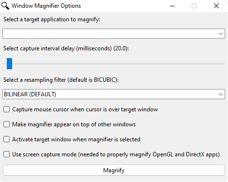

Window Magnifier
---

A utility to scale a single application window without magnifying the entire desktop.

This utility works by:
1. Capturing the visible content of the target application that we want to magnify as an image
2. Scaling the image to fit within the bounds of the magnifier display window
3. And finally displaying the scaled image in the magnifier display window

### Running
The application can be executed using two methods.

For both methods you should first run the `CreateVenv.ps1` script to create a new virtual environment and install the
necessary dependencies.

Once the script is complete the application can be run directly through the terminal using a command like:
`python -m magnifier.start`

Or, if you prefer, you can package the application into an executable by running the `Package.ps1` script.
After running the package script you can find the application in the `dist` directory under the path
`dist/window-magnifier/window-magnifier.exe`
